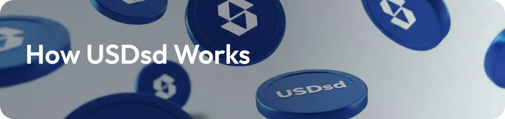

## What is USDsd?

USDsd is a synthetic, collateralized version of Tether that provides a stable and scalable solution to the trader market. Unlike traditional stablecoins like USDC or USDT, USDsd is designed to be stable, scalable, and censorship-resistant while offering attractive yields through advanced trading strategies.

<Info>
  USDsd stands for "USD Standard Dollar" - a synthetic dollar that provides a
  better alternative to traditional stablecoins with yield generation
  capabilities.
</Info>

## Key Characteristics

<AccordionGroup>
  <Accordion title="High Yield Potential">
    

      
<strong>Up to 30% APY:</strong> USDsd offers the potential for up to 30% annual returns through basis trading strategies.

      
<strong>Current Yield:</strong> Currently earning 8% APY with room for growth based on market conditions.

      
<strong>No Lock-up Period:</strong> Enter and exit anytime with 0 lock-up period for maximum flexibility.

    

  </Accordion>

<Accordion title="Basis Trade Strategy">
  

    

      <strong>Advanced Algorithms:</strong> Our algorithms short perps and long
      spot simultaneously to earn yields.
    

    

      <strong>Exchange Integration:</strong> Works with major exchanges like
      Binance, OKX, and Bybit.
    

    

      <strong>Real-time Execution:</strong> Yields are earned in real-time from
      perpetual trading activities.
    

  

</Accordion>

  <Accordion title="100% Collateralized">
    

      
<strong>Full Backing:</strong> USDsd is 100% collateralized by USDT, ensuring stability and security.

      
<strong>Transparent Reserves:</strong> All collateral is transparently held and verifiable.

      
<strong>Risk Management:</strong> Sophisticated risk management ensures peg stability.

    

  </Accordion>
</AccordionGroup>

## How USDsd Maintains Its Peg

USDsd maintains its 1:1 peg to the US dollar through a sophisticated delta-neutral strategy that combines crypto asset collateral with derivatives hedging:

<Steps>
  <Step title="Crypto Asset Collateral">
    USDsd is backed by crypto assets like ETH, BTC, and stablecoins (USDT, USDC)
    held as collateral
  </Step>
  <Step title="Delta-Neutral Hedging">
    Simultaneously holds long positions in crypto assets and equivalent short
    positions in perpetual futures
  </Step>
  <Step title="Price Stability">
    Fluctuations in crypto asset prices are offset by corresponding gains/losses
    in short positions
  </Step>
  <Step title="Yield Generation">
    Revenue generated from staking rewards and positive funding rates on short
    positions
  </Step>
  <Step title="Reward Distribution">
    All generated yield is distributed to sUSDsd holders as rewards
  </Step>
</Steps>

## Supported Collateral Types

<Columns cols={2}>
  <Card title="USDT" icon="dollar-sign">
    **Tether (Primary)** - 100% collateralization - High liquidity - Stable peg to USD
  </Card>

{" "}

{" "}

<Card title="USDC" icon="credit-card">
  **USD Coin** - 100% collateralization - High liquidity - Stable peg to USD
</Card>

{" "}

<Card title="ETH" icon="ethereum">
  **Ethereum** - Used for basis trading - High volatility potential - Delta
  hedging strategies
</Card>

  <Card title="BTC" icon="bitcoin">
    **Bitcoin** - Alternative trading pair - Market liquidity - Diversified exposure
  </Card>
</Columns>

## USDsd vs Traditional Stablecoins

<AccordionGroup>
  <Accordion title="Traditional Stablecoins (USDT, USDC)">
    

      
• <strong>No Yield:</strong> Traditional stablecoins earn 0% yield

      
• <strong>Centralized:</strong> Controlled by centralized entities

      
• <strong>Limited Innovation:</strong> Basic store of value functionality

      
• <strong>Regulatory Risk:</strong> Subject to banking and regulatory oversight

      
• <strong>No Trading Benefits:</strong> No additional utility beyond storage

    

  </Accordion>

  <Accordion title="USDsd (Standard Money)">
    

      
• <strong>High Yield:</strong> Earn up to 30% APY through basis trading

      
• <strong>Decentralized:</strong> Operates on decentralized infrastructure

      
• <strong>Innovative:</strong> Advanced trading algorithms and strategies

      
• <strong>Censorship Resistant:</strong> Not subject to traditional banking regulations

      
• <strong>Trading Utility:</strong> Generates yield through sophisticated trading

    

  </Accordion>
</AccordionGroup>

## The Standard Money Advantage

Standard Money makes USDT what it was always meant to be - a 'stopover' for traders that actually generates yield:

<Columns cols={2}>
  <Card title="Better Than Parking" icon="arrow-up">
    Instead of parking USDT at 0% yield, earn up to 30% APY with USDsd
  </Card>

{" "}

<Card title="Advanced Trading" icon="rocket">
  Sophisticated basis trading algorithms optimized for USDT and higher yields
</Card>

{" "}

<Card title="Trader Focused" icon="users">
  Designed specifically for the trader market with instant liquidity
</Card>

  <Card title="Exchange Integration" icon="right-left">
    Direct integration with major exchanges for optimal execution
  </Card>
</Columns>

## Use Cases

<AccordionGroup>
  <Accordion title="High-Yield Savings">
    

      
• <strong>Yield Generation:</strong> Earn up to 30% APY on dollar-denominated savings

      
• <strong>No Lock-up:</strong> Access funds anytime without penalties

      
• <strong>Stable Value:</strong> Maintain USD peg while earning yield

    

  </Accordion>

{" "}

<Accordion title="Trading & DeFi">
  

    

      • <strong>Liquidity Provision:</strong> Provide liquidity in USDsd pairs
      on DEXs
    

    

      • <strong>Collateral:</strong> Use USDsd as collateral in lending
      protocols
    

    

      • <strong>Trading:</strong> Trade USDsd against other assets
    

  

</Accordion>

  <Accordion title="Portfolio Management">
    

      
• <strong>Diversification:</strong> Diversify stablecoin holdings with yield-bearing option

      
• <strong>Risk Management:</strong> Hedge against inflation with crypto-native yield

      
• <strong>Capital Efficiency:</strong> Maximize returns on idle capital

    

  </Accordion>
</AccordionGroup>

## Getting Started

<Columns cols={2}>
  <Card title="Mint USDsd" icon="plus" href="/quickstart">
    Learn how to mint USDsd with supported collateral
  </Card>

{" "}

<Card title="Stake for Yield" icon="lock" href="/user-guides/staking-usdsd">
  Stake USDsd to receive sUSDsd and earn rewards
</Card>

{" "}

<Card title="Staking USDsd" icon="lock" href="/user-guides/staking-usdsd">
  Learn how to stake USDsd for rewards
</Card>

  <Card title="Technical Details" icon="gear" href="/user-guides/overview">
    Deep dive into the technical architecture
  </Card>
</Columns>

<Note>
  USDsd represents a new paradigm in stablecoin design, combining the stability
  of traditional stablecoins with the innovation and yield potential of advanced
  trading strategies.
</Note>
